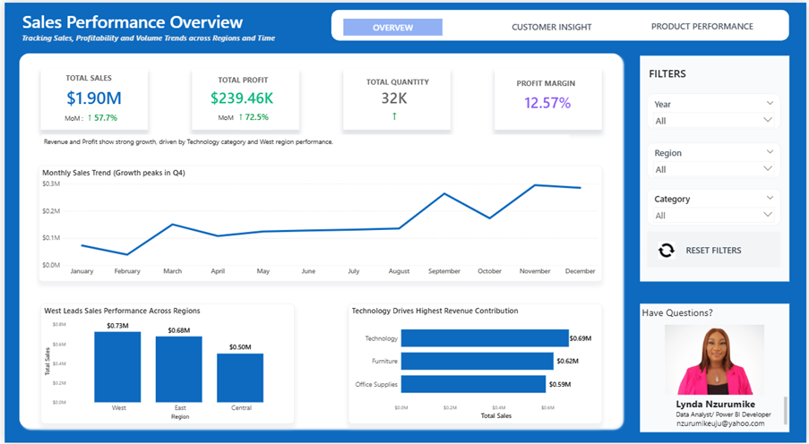
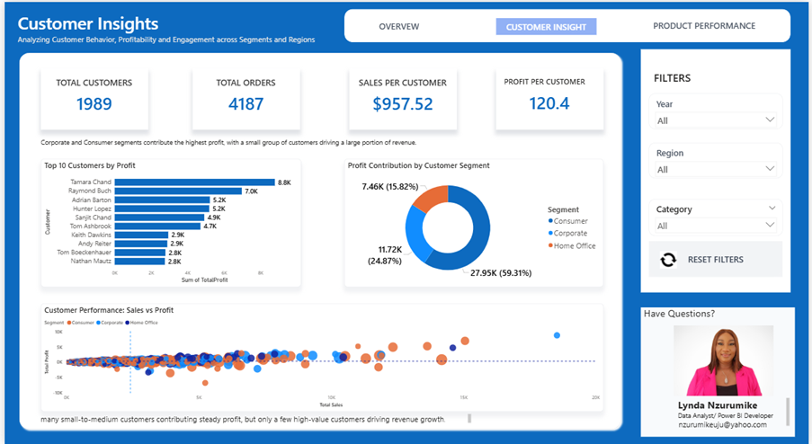
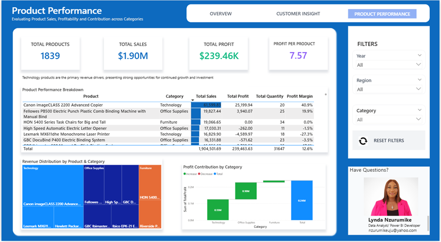

# From Excel to SQL Server: Sales Data Warehouse for Power BI

##  Project Overview

This project demonstrates an end-to-end data workflow where raw Excel sales data is transformed into a structured SQL Server data warehouse and then visualized in Power BI.

The goal was to simulate a real-world business scenario where an organization relies on Excel for data storage but needs a scalable, reliable system for reporting and analytics.

The core focus of this project is **SQL-based data ingestion, cleaning, validation, and modeling**, with Power BI serving as the final reporting layer.

---

## Business Scenario

Many organizations store operational data in Excel, which leads to challenges such as:

- Data inconsistency  
- Limited scalability  
- Difficulty in reporting  
- Lack of automation  

This project addresses those challenges by:

1. Migrating Excel data into SQL Server  
2. Cleaning and validating the data using T-SQL  
3. Building a star schema data model  
4. Creating reporting views for Power BI  

---

##  Project Objectives

- Import multi-sheet Excel data into SQL Server  
- Consolidate regional datasets into a unified staging table  
- Perform data cleaning and validation using SQL  
- Identify and remove duplicate records  
- Build dimension and fact tables (star schema)  
- Create reporting-ready SQL views  
- Connect SQL Server to Power BI for dashboard reporting  

---

##  Tools & Technologies

- SQL Server  
- SQL Server Management Studio (SSMS)  
- T-SQL  
- Excel  
- Power BI  
- DAX  

---

##  Project Workflow (SQL Focus)

### 1. Data Ingestion
- Imported Excel sheets (Central, East, West) into SQL Server  
- Created staging tables for each region  

### 2. Data Consolidation
- Combined all regional tables into a single staging table  
- Preserved data source integrity  

### 3. Data Validation
- Performed row count checks  
- Checked for NULL values  
- Validated date consistency  
- Identified blank text fields  

### 4. Data Cleaning & Deduplication
- Detected duplicates using `ROW_NUMBER()` with `PARTITION BY`  
- Removed duplicate business records  
- Trimmed and cleaned text fields  

### 5. Dimensional Modeling
Created a star schema:

**Dimensions:**
- DimCustomer  
- DimProduct  
- DimLocation  
- DimDate  

**Fact Table:**
- FactSales  

### 6. Fact Table Loading
- Joined staging data to dimension tables  
- Assigned surrogate keys  
- Resolved join mismatches and duplication issues  

### 7. Reporting Layer
- Created SQL views:
  - Sales Summary  
  - Customer Performance  
  - Product Performance  

These views were used directly in Power BI.

---

##  Key SQL Skills Demonstrated

- Data ingestion from Excel into SQL Server  
- Staging table design  
- Data validation and reconciliation  
- Duplicate detection using `ROW_NUMBER()`  
- Handling NULL and blank values  
- Data cleaning using `LTRIM`, `RTRIM`  
- Use of Common Table Expressions (CTEs)  
- Building star schema (fact and dimension tables)  
- Debugging join issues and data mismatches  
- Creating reporting views for BI tools  

---

##  Data Challenges Solved

During development, several real-world data issues were identified and resolved:

- Duplicate records in staging tables  
- Fact table row inflation due to duplicate dimension keys  
- Missing records caused by join mismatches  
- NULL-sensitive joins affecting location matching  
- Data inconsistencies across regional datasets  

These were resolved through SQL debugging, validation queries, and data modeling adjustments.

---

##  Power BI Dashboard

After completing the SQL modeling, Power BI was used to build a 3-page interactive dashboard:

### 1. Executive Overview
- KPI tracking (Sales, Profit, Quantity, Margin)  
- Monthly trends  
- Regional performance  

### 2. Customer Insights
- Customer segmentation  
- Sales vs Profit scatter analysis  
- Top customers by profitability  

### 3. Product Performance
- Product-level sales and profit analysis  
- Revenue distribution (treemap)  
- Profit contribution (waterfall chart)  

---

##  Dashboard Preview

### Executive Overview

### Customer Insights

### Product Performance

---

## 📈 Key Insights

- Technology category drives the highest revenue  
- A small number of customers contribute significantly to profit  
- Some products have high sales but low profitability  
- Regional performance varies across the dataset  

---

##  What This Project Demonstrates

This project demonstrates my ability to:

- Design and implement SQL-based data pipelines  
- Clean and validate real-world data using T-SQL  
- Build a dimensional data model for analytics  
- Troubleshoot data issues and ensure data integrity  
- Prepare structured data for business intelligence tools  
- Deliver insights through interactive dashboards  

---

##  Future Improvements

- Automate ETL using SSIS or Azure Data Factory  
- Implement incremental data loading  
- Add stored procedures for repeatable workflows  
- Publish dashboard to Power BI Service  

---

## 📁 Project Structure
sql/ → SQL scripts for ETL and modeling
screenshots/ → Dashboard images
docs/ → PDF export of dashboard
README.md → Project documentation

---

## 🔗 Author

**Obianuju (Lynda) Nzurumike**  
Data Analyst | Business Intelligence & Analytics Engineer  
Calgary, Alberta, Canada  

---
